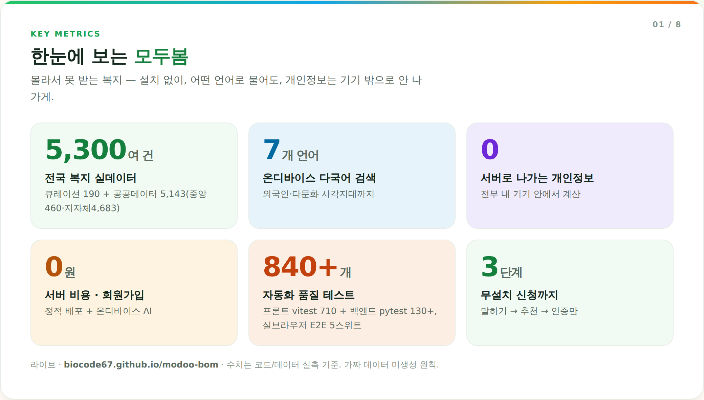

# 모두봄 (ModooBom)

> 내 복지 혜택, 모두 찾아드릴게요  
> 개인 복지 자산 관리 AI Agent · 2026 AI·SW 중심대학 디지털 경진대회 SW부문

### 라이브 데모 — https://biocode67.github.io/modoo-bom/
### 지금 바로 체험·설치 (웹 QR + 안드로이드 앱) — https://biocode67.github.io/app.html
### 심사위원용 실행 가이드 — [docs/제출/심사위원-실행-가이드.md](docs/제출/심사위원-실행-가이드.md) (웹 0분 · 데스크탑앱 2분 · 인증 없이 보는 코스 포함)

### 시연 영상 — https://youtu.be/7hsiDM1Ej9s

[](https://youtu.be/7hsiDM1Ej9s)

### 핵심 시연 (서류 발급·신청 자동화) — https://youtu.be/c8FwDnrkEiY

[](https://youtu.be/c8FwDnrkEiY)

> 모두봄의 AI는 **브라우저에서 직접 도는 온디바이스 AI**입니다 — 복지 추천·다국어 의미검색·급여계산이 회원가입도, 서버 전송도 없이 항상 즉시 동작합니다.

    

회원가입·백엔드 없이 바로 동작합니다. 프론트엔드는 **전국 약 5,300건 복지**(보건복지부 검증 큐레이션 124 + 정부지원사업·청년주택·서민금융 45
+ 민간재단 큐레이션 21 + 한국사회보장정보원 공공데이터 5,143(중앙460·지자체4,683) — 현대차 정몽구 스칼러십·심장재단 수술비 등
민간은 전 항목 공식 사이트 실측 검증, 이름 기준 병합·디듑)와 자격 판정 엔진, 그리고 브라우저에서 직접 도는 AI를 실행하므로 즉시 로딩되고 항상 켜져 있습니다.
(데스크탑 앱을 연결하면 정부24 서류 자동발급·복지로 신청 자동화 등 고급 기능이 더해집니다.)



**주요 기능**
- **온디바이스 다국어 AI 의미검색 (헤드라인)** — 브라우저에서 직접 도는 신경망 임베딩(multilingual-e5-small)으로 5,220여 건을 *의미*로 매칭. 한국어·English·Tiếng Việt·中文·日本語 교차검색(외국인·다문화 복지 사각지대). AI 대화형 답변 + 음성, 입력 언어 자동감지 — 서버 전송 0(전부 기기 내).
- **데스크탑 원클릭 자동화 (대회 하이라이트)** — '전부 자동발급 + 자동신청까지' 한 번으로: 정부24 서류 순차 발급(로그인 인증 1회 — 승인만 본인, 일시 오류 자동 재시도) → 복지로 신청 양식 자동작성 + **방금 발급물 자동첨부** → **제출 직전 정지**(제출은 본인 확인). 진행률 바·단계 건너뛰기·인증 알림음·새로고침 이어보기·발급 전 원버튼 점검·내 서류함·촬영 등록 — 전부 실브라우저 E2E로 회귀 고정.
- **행동형 챗 에이전트** — 프로필을 알고 답하고("내가 뭐 받을 수 있어?" → 자격+이유), 대화 맥락을 기억하며("그거/다 담아줘" 한마디로 관심목록 저장), 열면 급한 마감·서류부터 브리핑. 전부 규칙엔진(서버·LLM 불필요, 환각 없음)
- **통화형 상담** — 전화 걸듯 말로 묻고 소리로 듣는 풀스크린 상담(챗과 같은 두뇌). 상황을 말하면 그 자리에서 진단·음성 브리핑, "담아줘"도 말로. 다국어 통화(영어·베트남어·중국어): 자국어 인사로 시작하고 외국어 발화는 자국어 안내 후 AI 의미 검색으로 연결. 음성 미지원 브라우저는 같은 화면 큰 입력창(이중 경로)
- **대화형 온보딩 "새싹이와 대화"** — 폼 대신 마스코트가 한 번에 하나씩 묻고 탭으로만 답하는 프로필 입력. 어르신(65+) 선택 시 큰글씨 원탭 제안, 질문 음성 읽어주기(TTS), 새로고침해도 이어서(임시저장)
- **외국인 딥퍼널 다국어 UI** — 외국어로 검색하면 정책 상세·신청 키트의 UI 골격이 자국어로(en·vi·zh·ja·th·ru·ar) + 통역 배너(전화 1577-1366 다누리). AI 검색 결과 카드는 브라우저 내장 Translator로 기기 안에서 자동 번역('자동 번역' 배지, 미지원 브라우저는 한국어 원문), 상세 본문·신청·자격 기준은 한국어 원문
- **수급 조합 도우미** — 받을 수 있는 복지끼리의 관계 안내: "하나만"(기초연금↔장애인연금)·"감액 주의"(기초연금→생계급여)·"병급 가능"(아동수당+부모급여), 공식 출처 실측
- **본문 인라인 쉬운말** — 상세의 어려운 행정용어(소득인정액·차상위 등 26개)를 점선밑줄로 표시, 탭하면 그 자리에서 쉬운 설명 팝오버
- **주민센터 방문 키트** — 정책 1건을 큰 글씨 A4로 인쇄(창구 멘트·담당 전화·서류 체크리스트) — 디지털 소외층의 실제 신청 경로 지원
- **가족 도움 링크** — 어르신·장애인의 복지 신청을 가족이 대신. 프로필(이름 제외)+담은 정책을 온디바이스 링크로 공유→받은 폰에서 재계산(서버 전송 없음)
- **지원형태 필터** — 현금/바우처·카드/요금감면/서비스·현물/융자·대출로 분류해 탐색 필터·카드 배지(지자체 요약 정책까지 신호로 분류)
- **민간재단 큐레이션** — 정부 데이터 어디에도 없는 기업·재단의 장학·의료비·위기지원 21건(현대차 정몽구·관정·삼성꿈장학·아산 SOS·초록우산 등)을 실측 검증해 수록. 분석 결과 전용 섹션·탐색 필터·긴급진단 연계(정부 제도 우선 랭킹)
- **확인/조회** — 1분 프로필 위저드 + 자격 판정(2026 정밀 선정기준), 약 5,300종 정책 탐색·검색, 대화형 AI 상담 챗봇(연령·상황·소득으로 좁혀 추천)
- **선택/관리** — 관심목록·신청 상태 관리·혜택 계산기·정책 비교, 복지 수혜 점수(미수령 사각지대 + 지금 챙길 TOP3)
- **사후관리** — 신청 준비·진행 점검·갱신 자동 알림(복지 비서), 복지 캘린더 + .ics 내보내기
- **신청** — 단계별 가이드, 서류 준비 도우미, 정부24·복지로 스마트 연동, 에이전트 반자동 신청(백엔드 시, 인증·최종제출은 본인)
- **혁신** — 생애주기 시뮬레이터(미래 받을 복지), 긴급복지 빠른 진단(위기 상황), 우리 가족 복지 한눈에(가구 단위), 결과 공유(이미지 카드)
- **접근성** — 음성 입력·음성 안내(TTS), 큰글씨, 인쇄/PDF("내 복지 안내서"), reduced-motion
- **3D 카툰 UI / PWA** — 새싹 마스코트(React Three Fiber, 지연 로딩) + framer-motion, 반응형, 설치형·오프라인 PWA

품질: ESLint(0) · 단위 테스트(vitest 775 + pytest 262) · 실브라우저 E2E 12스위트(웹·데스크탑·모바일·촬영·흐름·접근성) · TypeScript · ErrorBoundary · 주요 복지 금액 2026년 공식 출처 검증

### 자동 서류발급 · 자동 신청

정부24·복지로·건강보험공단·고용24를 에이전트가 직접 조작해 서류 발급(데스크탑 앱 15종·확장 13종)·복지 신청을 진행합니다. 세 가지 방법:

**① 데스크탑 앱 (대회 데모 경로 — Windows 더블클릭, 원클릭 연쇄)**
```bat
setup-local.bat      :: 최초 1회 (저장소 루트에서 — 경량 venv + 프론트 빌드)
run-local-app.bat    :: 이후 더블클릭 — git 최신이면 자동 재빌드 후 localhost:8000 실행
```
동일 출처 서빙 + 실크롬 RPA. 나의 복지 → 서류 도우미의 **[전부 자동발급 + 자동신청까지]** 가
발급→자동첨부→제출 직전 정지를 한 흐름으로 진행합니다(개인정보는 이 PC 안에서만).

**② 크롬 확장 (서버 없이, 배포 사이트에서 바로)**
`chrome://extensions` → 개발자 모드 → '압축해제된 확장 프로그램 로드' → 저장소의 `extension/` 폴더.
배포 웹이 확장을 감지해 자동발급/자동신청 버튼이 켜집니다. 자동화가 **사용자 브라우저 안에서** 실행돼 개인정보가 서버로 가지 않아요.

**③ 로컬 백엔드 (Playwright)**
```bash
./run-local.sh        # 셋업(venv·패키지·Chromium·npm) + 백엔드(8000)+프론트(5173) 한 번에
#  → http://localhost:5173 접속 시 백엔드가 감지되어 '자동발급/자동신청' 버튼이 활성화
```
- **자동 발급**: 나의 복지 → *서류 준비 도우미* → 서류별 `자동` 버튼
- **자동 신청**: 정책 상세 → *에이전트로 신청 시작*
- 카카오 본인인증과 최종 제출은 본인이 직접 합니다(정부 사이트 법적 요건 — 무인 대행 불가). 나머지(로그인 화면 이동·양식 자동작성·발급/제출 직전까지)는 에이전트가 운전합니다.

### 배포 (정적 사이트)

main 푸시 시 GitHub Actions(`.github/workflows/deploy.yml`)가 자동으로 빌드해 gh-pages로 배포합니다. 수동 배포도 가능합니다:

```bash
cd frontend
npm run deploy   # 빌드 후 gh-pages 브랜치로 배포 → GitHub Pages
```

### 복지정책 카탈로그 확장 (전체 정책 담기)

기본 제공 약 5,300건(큐레이션 시드 190 = 정부 124 + 지원사업 33 + 민간재단 21 + 주택공고 7 + 서민금융 5, + 중앙부처·지자체 공공데이터 5,143, 이름 디듑 후)을
정부 공식 공개데이터로 계속 갱신·확장할 수 있습니다. 프론트가 `public/policies.json`을 런타임에 자동 병합하므로 코드 수정 없이 늘어납니다.

```bash
cd backend && source venv/bin/activate
# (쉬움) 키 없이 — 복지로 중앙부처 367건 CSV를 받아서:
#   https://www.data.go.kr/data/15083323/fileData.do → 다운로드
python etl/ingest_welfare.py --csv ~/Downloads/한국사회보장정보원_복지서비스정보_*.csv
# (포괄) 무료 키로 — 중앙부처 1,600+건:
#   export DATA_GO_KR_SERVICE_KEY=발급키 ; python etl/ingest_welfare.py --api
cd ../frontend && npm run deploy
```
자세한 안내: [backend/etl/README.md](backend/etl/README.md)

### 로그인 · 클라우드 동기화 (선택)

로그인 없이도 모든 기능이 동작하지만, 카카오·구글 로그인을 켜면 기기 간 '나의 복지' 신청 현황이
동기화됩니다. 정적 사이트에서 서버 없이 동작하도록 Supabase(무료)를 사용하며, 미설정 시에는
관련 코드가 빌드에서 제외되어 콜드스타트에 영향이 없습니다(로그인 UI도 숨김).

```bash
# 1) Supabase 프로젝트 생성 + supabase/schema.sql 실행 (RLS 포함)
# 2) Authentication → Providers 에서 Kakao/Google 활성화
# 3) frontend/.env 에 URL/anon key 입력 후
cd frontend && npm run deploy
```
설정 절차 전체: [supabase/SETUP.md](supabase/SETUP.md)

---

## 지금 바로 실행하기 (풀스택 로컬 개발)

### 준비물

- Python 3.11+
- Node.js 20+
- (선택) LLM API 키 — Gemini 2.5 Flash 기준, Groq·Claude 자동 폴백. 없어도 Mock 모드로 전체 동작함

---

### 1단계 — 백엔드 실행

```bash
cd modoo-bom/backend

# 가상환경 생성 & 활성화
python3 -m venv venv
source venv/bin/activate        # Windows: venv\Scripts\activate

# 패키지 설치
pip install -r requirements.txt

# 환경변수 설정
cp .env.example .env
# .env 파일 열어서 LLM 키 입력 — GEMINI_API_KEY 권장, GROQ/ANTHROPIC 키도 가능 (없으면 그냥 두면 Mock 모드 자동 동작)

# 서버 실행
uvicorn main:app --reload --port 8000
```

서버가 뜨면 브라우저에서 확인:
- 헬스체크: http://localhost:8000/api/health
- API 문서: http://localhost:8000/docs

---

### 2단계 — 프론트엔드 실행

```bash
# 새 터미널에서
cd modoo-bom/frontend

npm install
npm run dev
```

브라우저에서 http://localhost:5173 접속

---

### Mock 모드 (LLM 키 없이 테스트)

`.env`에 LLM 키(`GEMINI_API_KEY` 등)를 설정하지 않으면 자동으로 Mock 모드 동작:

| 노드 | Mock 동작 |
|------|-----------|
| profile_analyzer | 키워드 규칙 기반 추출 |
| policy_search | 샘플 120건에서 키워드 매칭 |
| eligibility_check | 연령·소득·장애 규칙 판별 |
| reflection_check | 규칙 기반 검증 |
| guide_generator | 템플릿 가이드 |
| doc_retrieval | 정부24 API Mock (지연 시뮬레이션) |
| orchestrator | 마크다운 요약 생성 |

---

### 3단계 — 테스트 실행

```bash
cd modoo-bom/backend
source venv/bin/activate

# pytest 설치 (requirements.txt에 없으면)
pip install pytest pytest-asyncio

# 전체 테스트
pytest tests/ -v

# 특정 테스트
pytest tests/test_mock_mode.py::test_full_graph_mock_elderly -v
```

---

### Docker Compose로 한 번에 실행

```bash
cd modoo-bom

# ANTHROPIC_API_KEY 없으면 Mock 모드로 자동 동작
ANTHROPIC_API_KEY=sk-ant-... docker compose up --build

# 또는 Mock 모드
docker compose up --build
```

---

## 데모 시나리오 (추천 순서)

웹 UI에서 빠른 데모 프로필 버튼을 클릭하세요:

| 프로필 | 기대 결과 |
|--------|-----------|
| 독거 노인 (72세) | 기초연금, 노인 일자리, 맞춤돌봄서비스 등 |
| 청년 취준생 (26세) | 실업급여, 국민취업지원, 청년 월세지원 등 |
| 신혼 출산 가정 (32세) | 부모급여, 아동수당, 국민행복카드 등 |
| 중증장애인 (45세) | 장애인연금, 활동지원서비스 등 |

각 프로필은 클라이언트 복지 엔진이 즉시 분석하고(서버 불필요), 백엔드 연결 시 LangGraph 스트리밍·RPA 자동화가 추가로 활성화됩니다.

---

## 아키텍처

**이중 모드** — 배포(정적)에서는 백엔드 없이 완전 동작, 백엔드 연결 시 LLM·RPA 고급 기능 활성화.

```
[프론트엔드 — 항상 동작 / GitHub Pages]
  React 18 + Vite + TypeScript + TailwindCSS
  React Three Fiber(3D) · framer-motion · zustand(persist) · PWA
  └ 클라이언트 복지 엔진(welfare-engine.ts) + 정책 카탈로그(catalog.ts)
        ↕  (백엔드 감지 시에만)
[백엔드 — 선택 / 로컬·서버]
  FastAPI + LangGraph 10노드 + LLM(Gemini 2.5 Flash, Groq·Claude 자동 폴백) + 하이브리드 RAG(BM25+임베딩 RRF)
  + Playwright RPA(정부24·복지로·건보·고용24)
        ↕
[공공데이터 ETL] 한국사회보장정보원 복지서비스 → public/policies.json
```

- **클라이언트 엔진**: 백엔드 `mock_responses.py`의 자격판정·키워드·가이드·혜택계산을 TS로 포팅 → 브라우저에서 즉시 실행.
- **백엔드(선택)**: 아래 LangGraph 10노드 파이프라인 + 실제 RPA. 프론트가 `useBackend`로 감지해 있으면 연결.

### (선택 백엔드) LangGraph 10노드 플로우

```
① profile_analyzer   → 프로필 분석 + 키워드 추출
② policy_search      → ChromaDB RAG 검색 (Mock: 키워드 매칭)
③ eligibility_check  → LLM 자격 판별 (Mock: 규칙 기반)
④ reflection_check   ⇆ ③ (검증 실패 시 최대 2회 재판별)
⑤ guide_generator   → 신청 가이드 생성
⑥ doc_retrieval      → 정부24 API Mock 서류 자동 취득
⑦ portfolio_manager  → 복지 포트폴리오 요약
⑧ notification_agent → 생애이벤트 Push 알림
⑨ result_tracker     → 신청 결과 추적
⑩ orchestrator       → 최종 안내 메시지 생성
```

### WebSocket 메시지 포맷

```json
// 클라이언트 → 서버
{ "type": "start_analysis", "profile": { ... } }

// 서버 → 클라이언트 (스트리밍)
{ "type": "node_event", "node": "profile_analyzer", "status": "running", "message": "..." }
{ "type": "node_event", "node": "profile_analyzer", "status": "done", "data": { ... } }

// 완료
{ "type": "complete", "result": { "eligible_policies": [...], ... } }
```

---

## API 엔드포인트

| Method | Path | 설명 |
|--------|------|------|
| `WS` | `/ws/analyze` | LangGraph 실행 + 실시간 스트리밍 |
| `GET` | `/api/health` | 서버 상태 + DB 정보 |
| `POST` | `/api/search` | 복지 정책 RAG 검색 |
| `POST` | `/api/documents/issue` | 서류 발급 (Mock) |
| `POST` | `/api/admin/seed` | ChromaDB 시딩(카탈로그 전체 — 클라우드 5,200여 건) |
| `GET` | `/api/admin/env` | 환경변수 상태 확인 |

---

## 파일 구조

```
modoo-bom/
├── backend/                         # 선택 — FastAPI + LangGraph + RPA
│   ├── main.py                      # FastAPI 진입점 (REST + WebSocket)
│   ├── agents/                      # state.py, graph.py, mock_responses.py, nodes/(10노드)
│   ├── rag/sample_data.py           # 복지 정책 120건 (+ embedder/chromadb)
│   ├── api/                         # routes.py(REST), websocket.py, chat.py
│   ├── rpa/                         # Playwright 자동화: gov24/nhis/work24/apply + base/manager/orchestrator(연쇄)
│   ├── local_server.py              # 데스크탑앱 경량 서버(dist-app 동일출처 서빙 + RPA) — run-local-app.bat/EXE 진입
│   ├── agent_entry.py               # PyInstaller EXE 진입점
│   ├── etl/ingest_welfare.py        # 공공데이터 → policies.json (중앙 --api / 지자체 --local / CSV)
│   └── tests/                       # pytest 262 (Mock·RPA 취소/정직성/패리티·서류함·세션·프리플라이트)
└── frontend/                        # 메인 — 백엔드 없이 동작 (정적 배포)
    ├── src/
    │   ├── App.tsx                  # 셸 + 상태기반 뷰(home/analyze/explore/my) + 챗봇/공유/인쇄
    │   ├── data/                    # policies.ts(120건 시드), catalog.ts(런타임 병합), useCatalog
    │   ├── lib/                     # welfare-engine, simulate, monitoring, calendar, emergency,
    │   │                            #   guidedChat, share, useSpeech, useTTS, useBackend, format …
    │   ├── store/useAppStore.ts     # zustand persist (관심·상태·프로필·rpaInfo)
    │   ├── three/                   # SproutMascot, HeroScene, MascotCanvas(지연 로딩)
    │   ├── sections/                # Home(Hero/HowItWorks/Features/Faq), Analyze, Explore, My
    │   ├── components/              # ProfileWizard, ResultsView, WelfareScore, FutureWelfare,
    │   │                            #   MonitorFeed, WelfareCalendar, HouseholdAnalyzer,
    │   │                            #   EmergencyHelp, DocumentCenter, AgentSubmitButton,
    │   │                            #   DocVault(서류함), AgentStatusStrip(점검), DocCameraModal(촬영),
    │   │                            #   PolicyCard/Drawer, BenefitCharts, ChatWidget, ShareButton …
    │   └── src/**/*.test.ts         # vitest 775 (엔진·검색·모니터링·docScan·authCue …)
    └── public/                      # favicon, 404.html, robots.txt, (policies.json: ETL 생성)
```

---

## 팀 모두봄

| 이름 | 역할 |
|------|------|
| 김주형 | PM / 백엔드 (LangGraph, FastAPI) |
| 류다영 | AI·ML (RAG, Reflection Loop) |
| 신주현 | 데이터 (ChromaDB, ETL) |
| 이준영 | 프론트엔드 (React, WebSocket) |
| 장지웅 | 기획·UX |

---

# 프로젝트 상세

## 1. 배경 — 왜 이 문제인가

한국 복지는 신청주의다: 자격이 있어도 신청해야 받는다. 그런데,
- **흩어짐**: 중앙부처·지자체(226개 시군구)·민간재단이 제각각 공고. 민간재단은 어떤 정부 포털에도 없다.
- **어려움**: '기준 중위소득', '소득인정액', '차상위' — 가장 필요한 사람(어르신·저소득·외국인)이 가장 못 읽는다.
- **번거로움**: 자격 확인→서류 발급→신청서 작성 각 단계에서 이탈한다.
- **기존 앱의 실패(실측)**: 복지로 앱 등 공공 앱에 대한 실제 사용자 불만 — "입력하다 상태를 잃음", "글씨가 작음",
  "결국 PC를 켜야 함", "로그인·인증 복잡", "먹통·막다른 길", "항의해도 응답 없음"
  (출처: 앱스토어 리뷰, 투데이e코노믹 "복지부 앱은 왜 외면받았나", 국가인권위·보건사회연구원 노인 디지털소외 자료).
- **시장 공백**: 토스 '숨은 정부지원금 찾기'는 2024년 8월 종료.

→ 결론: 필요한 것은 '더 나은 검색'이 아니라, 사용자를 대신해 주는 에이전트다.

## 2. 솔루션 — AI Agent 자율 루프

챗봇이 아니라 인지→판단→이해→행동→관찰의 순환 전체가 에이전트다.

| 단계 | 무엇을 하나 | 구현 |
|---|---|---|
| 인지 | 새싹이와 대화 온보딩(탭만으로 입력) · 자연어 한 문장 · 음성 | `MascotChat` + `onboardingFlow` + `parseQuery` (규칙 NLU, 환각 0) |
| 판단 | 약 5,300건에서 자격판정(2026 공식 선정기준: 생계32·의료40·주거48·교육/차상위50%) · 확실/관련 신뢰도 분리 · 모집종료·인구불일치·소득초과 하드 게이트 | `welfare-engine.ts` (백엔드 `mock_responses.py`와 패리티) |
| 이해 | 쉬운 말 결과 · 용어사전 · 7개 언어 AI 답변(EN·VI·ZH·JA·TH·RU·AR) · TTS 읽어주기 | `aiAnswer.ts` + `glossary` + `useTTS` |
| 행동 | 챗 "다 담아줘"→실제 저장 · 서류 최대 15종 자동발급 · 복지 6종+일반화 자동신청(RPA) · 원탭 신청(정보복사+공식페이지) | `chatAgent` + 데스크탑 앱·크롬 확장 + `quickApply` |
| 관찰 | 마감 D-day·갱신 임박·서류 미비 감시 · 앱 열면 먼저 브리핑 · 프로필 변화 시 새 복지 제안 | `monitoring.ts` + `continuity.ts` + `LifeTimeline` |

**설계 철학(human-in-the-loop)**: 본인인증·최종 제출은 법이 사람에게 요구하는 단계 — 자동화하지 않는 것이 원칙.
심사 질문 "완전 자동이 되나요?"에 대한 답: "안 되는 게 아니라, 안 하는 게 옳습니다."

## 3. 데이터 — 약 5,300건 전부 실데이터

| 출처 | 건수 | 검증 방식 |
|---|---|---|
| 지자체 복지(LOC-) | 4,683 | 한국사회보장정보원 OpenAPI(B554287) — 지역배지·시군구 2차 필터 |
| 중앙부처 복지(GOV-) | 463 | 동일 OpenAPI + 상세보강(온라인 신청 URL) |
| 정부 큐레이션(POL-) | 124 | 보건복지부 등 2026 공식 고시 수기 대조(기초연금 349,700원·생계급여 32% 등) |
| 정부 지원사업(SUP-) | 33 | 국토부·복지부 등 공식 페이지 실측(신생아 특례대출·희망저축·K-패스…) |
| 민간재단(PRV-) | 21 | 재단 공식 사이트 전수 생존·사업실체 확인(현대차 정몽구·아산·초록우산…) |
| 청년주택 공고(HOU-) | 7 | LH·SH·GH 등 살아있는 공고 게시판으로 연결(가짜 공고 미생성) |
| 정책서민금융(FIN-) | 5 | 서민금융진흥원 실측(햇살론·소액생계비 — '대출'임을 명시, 현금합산 제외) |

- 신청/발급 URL 70건 전수 생존검사(69건 생존, 1건 즉시 정정 — DNS 미해석 발견).
- 정책 벡터 5,222건 사전계산 → 온디바이스 의미검색.
- 갱신: `backend/etl/ingest_welfare.py` 재수집 → `policies.json` 교체만으로 반영(재빌드 불필요).

## 4. 아키텍처 — 3층 하이브리드

1. **온디바이스(기본, 항상 동작)** — React18+Vite PWA(GitHub Pages), 복지엔진, 신경망 의미검색(multilingual-e5-small,
   transformers.js), 모니터링. 개인정보 이탈 0 — 이름은 디스크에도 저장하지 않음(메모리만).
2. **백엔드(선택, 감지 시 자동 활성)** — FastAPI+WebSocket, LangGraph 10노드 StateGraph, LLM 지식형 챗(Gemini 2.5 Flash — Groq·Claude 자동 폴백), 하이브리드 RAG(BM25 주도+임베딩 RRF — 한국어 질의 실측 보정).
   미연결이면 규칙 폴백으로 동일 기능 — 폴백은 결함이 아니라 신뢰성 설계.
3. **실행층(선택, 데스크탑앱·크롬 확장)** — 정부24·복지로·건보·고용24 실사이트 RPA(여정 공유 세션 — 로그인 인증 1회).
   데스크탑앱은 원클릭 연쇄(발급→자동첨부→제출 직전 정지)·발급 전 점검·서류함·이어보기까지.
   CDP 신뢰클릭으로 안티봇(Mbuster) 통과 실증. 개인정보는 사용자 브라우저 안에서만.

**하이브리드 챗**: 행동·개인화=로컬 에이전트(즉시·정확), 지식 질문=클라우드 LLM(별도 라벨 표시, 12초 타임아웃), 실패=규칙 폴백.

## 5. 신뢰성 — 과장을 코드가 거부한다

- **정직성 코드화**: 민간재단·서민금융은 심사·상환형이라 `priority high/신뢰도 0.68↑` 표시가 테스트에서 거부됨.
  현금성 합산은 보수적(바우처·대출 제외). 모집종료 정책은 추천 제외(`isClosedForNew`).
- **품질 게이트**: 프론트 vitest 790 · 백엔드 pytest 331 · 실브라우저 E2E 12스위트(웹 10여정·데스크탑 31종·모바일·촬영·흐름·접근성 axe 0
  +대화온보딩·저장흐름·확장연동·라이브체크 전용 게이트) · lint 0 · tsc 0 — 매 변경마다 실행.
- **멀티에이전트 상호감사**: 29개 AI 에이전트가 데이터·URL·코드·문구·보안 5차원을 감사하고 발견마다 별도 검증자가 반박 시도 —
  확정 23건 전부 즉시 정정(오탐 1건은 반박으로 기각). "AI가 만들고 AI가 감사하는" 개발 프로세스 자체가 차별점.
- **보안·프라이버시**: 의존성 취약점 0 · CSP `unsafe-inline` 제거 · postMessage 발신자 검증 · XSS 싱크 0 ·
  개인정보처리방침에 제3자 연결(CDN·음성인식)까지 투명 고지 · 기기 데이터 전체삭제 경로 제공.
- **접근성**: Lighthouse 접근성 96·BP 100·SEO 100 — 큰글씨(어르신 원탭 제안)·고대비·TTS·음성입력·키보드 완주·모달 포커스트랩·reduced-motion.

## 6. 성과 지표 (라이브 실측)

| 지표 | 값 | 재현 방법 |
|---|---|---|
| 독거 어르신(72세·중위25%) 발견액 | 월 최대 639,700원 | 라이브에서 "72세 혼자 사는데 소득이 적어요" |
| 출산 가정(0세) 발견액 | 월 최대 1,193,000원 + 60일 소급 알림 | 데모 페르소나 '신혼 출산가정' |
| 중증장애인 발견액 | 월 최대 349,700원 + 민간 의료·재활 연계 | 데모 페르소나 '중증 장애인' |
| 서류 발급 조작 | 9단계 중 본인 1번(폰 인증 승인) | `npm run e2e:ext:headed` (실브라우저 검증) |
| 원클릭 연쇄(발급→자동첨부→신청 대기, 로그인 인증 1회·일시 오류 자동 재시도) | 클릭 1번 + 인증 승인만 | `npm run e2e:desktop` (30종 회귀) |
| 서류함 지능화(유효기간 배지·부족분만 발급·ZIP 묶음) | 이미 있는 서류는 건너뛰고 부족한 것만 | 동일 스위트 5.5·5.7 |
| 운영비 | $0 (정적+온디바이스) | GitHub Pages + 브라우저 내 AI |

※ 발견액은 '월 최대·중복 미반영' 기준 — 강력추천 중 현금성만 보수 합산. 결과 화면과 동일 수치.

